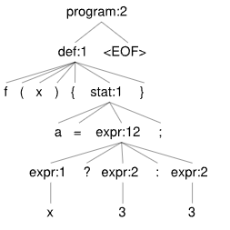

# Ejercicio 6: Antlr lab
Con cada uno de los siguientes ejemplos,
1. Considere que en el lenguaje dado por la cátedra el llamado a una función o método retorna el valor generado por la evaluacion de la última sentencia (stat, en la gramática)
2. Determine si hay un code smell y cual es.
3. Evalue el código en antlr lab usando las especificaciones del lexer y el parser
4. Estudie el árbol generado por antlr lab
5. Escriba un pseudocódigo que permita detectar el code smell en el árbol

## 6.4
```
f(x) {
    a = x ? 3 : 3;
}
```

## Code Smells
* Innecesary variable en 'a'
* Innecesary parameter en 'x'


## Arbol


## Pseudocódigo:
### Innecesary variable en 'a'
```
nodoActual = raiz;
while (not terminoArbol(nodoActual)){
    recorroArbol(nodoActual);
    if (nodoActual.contains('stat')){
        listaAsignaciones.add(nodoActual);
    }
}

for (asign : listaAsignaciones){

    badSmell = true;
    nodoActual = raiz;
    variable = asign.getHijos()[0];

    while (not terminoArbol() and badSmell == true){
        recorroArbol(nodoActual);
        if (nodoActual.contains('expr') and nodoActual.contains(variable)){
            badSmell = false;
        }
    }

    if badSmell ? informarBadSmell(asign) : skip;
}
```

### Innecesary conditional en 'x'
```
nodoActual = raiz;
while (not terminoArbol(nodoActual)){
    recorroArbol(nodoActual);
    if (nodoActual.contains('expr:12')){
        listaCondicionalesIfElse.add(nodoActual);
    }
}

for (cond : listaCondicionalesIfElse){
    badSmell = true;
    nodoActual = raiz;
    cond = asign.getHijos()[0];

    if cond[2] == cond[4] ? informarBadSmell(asign) : skip;
}
```